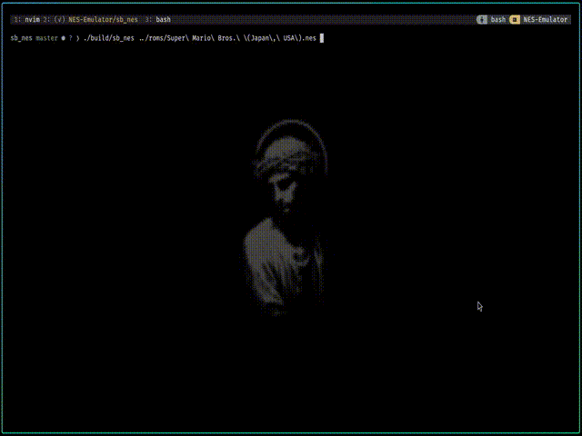

# sb_nes

mini demo:

there is still no audio output stuff.
and currently only work with [INES 1.0 mapper](https://www.nesdev.org/wiki/Mapper)

deps: 
- [SDL3](https://github.com/libsdl-org/SDL) (need to be install manually)
- [nob.h](https://github.com/tsoding/nob.h) (already in this repo)

all of the test i get it from here https://github.com/christopherpow/nes-test-roms
