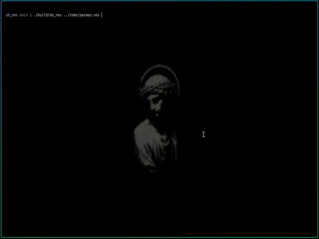

# sb_nes

mini demo:

SMB:<br>


pacman:<br>


<br>
there is still no audio output stuff(APU).
And currently only works with <a href="https://www.nesdev.org/wiki/Mapper" target="_blank" rel="noopener noreferrer">INES 1.0 mapper</a>

deps: 
- [SDL3](https://github.com/libsdl-org/SDL) (need to be installed manually)
- [nob.h](https://github.com/tsoding/nob.h) (already in this repo)

to build this project, `nob.c` need to be build first, then just run it
```bash
cc ./nob.c -o nob

./nob
```

to run the emulator, just add path of the rom:
```bash
./build/sb_nes ./yourrom.nes
```

All of the test i get it from here https://github.com/christopherpow/nes-test-roms
